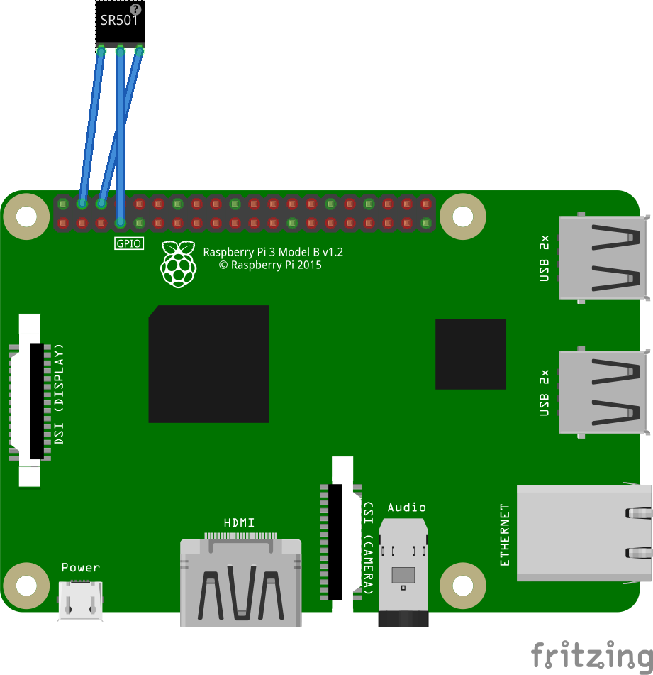

### 1, study for raspberry

##### 1. TLight.py
    参考url: https://my.oschina.net/qnloft/blog/1819817

##### 2. TDistance.py

    超声波距离传感器 HC-SR04

    HC-SR04共有4个引脚，分别是Vcc、Trig、Echo和Gnd。
    Vcc是供电口，需要5V电压供电。如果电压过低，模块不能正常工作，测量的数据不对。
    Gnd是接地口，Trig是触发口，Echo是接收数据的口。 
    具体接法是Vcc接树莓派任意5V电压输出口，Gnd接树莓派任意Gnd口，Trig和Echo分别接树莓派任意的GPIO口即可。
    参考url: http://zhaoxuhui.top/blog/2018/12/10/RaspberrySensors.html

##### 3. TDistance_light.py
    结合灯和距离传感器联动

##### 4. TDistance_infrared.py

    红外传感器测距
    1 VCC 外接3.3V-5V电压（可以直接与5v单片机和3.3v单片机相连）
    2 GND 外接GND
    3 OUT 小板数字量输出接口（0和1）
    参考url: http://zhaoxuhui.top/blog/2018/12/10/RaspberrySensors.html

##### 5. THuman.py

注意：传感器连接顺序

注意：左调节感应距离；右调节感应重复时间

    
    HC-SR501 人体感应模块 
    1、全自动感应:人进入其感应范围则输出高电平， 人离开感应范围则自动延时关闭高电平，输出低电平
    2、光敏控制(可选择，出厂时未设)可设置光敏控制，白天或光线强时不感应。 
    3、温度补偿(可选择，出厂时未设):在夏天当环境温度升高至 30~32°C，探测距离稍变 短，温度补偿可作一定的性能补偿。
    4、 两种触发方式:(可跳线选择) 
        a、不可重复触发方式:即感应输出高电平后，延时时间段一结束，输出将自动从高电平变成低电平; 
        b、可重复触发方式:即感应输出高电平后，在延时时间段内，如果有人体在其感应范围活动，其输出将一直保持高电平，直到人离开后才延时将高电平变为低电平(感应模块检 测到人体的每一次活动后会自动顺延一个延时时间段，并且以最后一次活动的时间为延时 时间的起始点)。
    5、具有感应封锁时间(默认设置:2.5S 封锁时间):感应模块在每一次感应输出后(高电平 变成低电平)，可以紧跟着设置一个封锁时间段，在此时间段内感应器不接受任何感应信 号。此功能可以实现“感应输出时间”和“封锁时间”两者的间隔工作，可应用于间隔探测产 品;同时此功能可有效抑制负载切换过程中产生的各种干扰。(此时间可设置在零点几秒 —几十秒钟)。
    6、 工作电压范围宽:默认工作电压 DC4.5V-20V。
    7、 微功耗:静态电流<50 微安，特别适合干电池供电的自动控制产品。 
    8、 输出高电平信号:可方便与各类电路实现对接。

##### 6. TLIRC.py

    红外传感器 
    打印红外接收器的按键编码

##### 7. TSound.py

    声音传感器 STC89C52
    传感器灵敏度调整，按图上顺时针为灵敏度低，逆时针为灵敏度高

### 2, saks 扩展板代码测试

##### 1.  saks_gpio.py 
    将温度传感器连接到扩展板的GPIO24口，读取温度和湿度

##### 2. saks_switch.py 
    SAKS板的按钮和拨动开关监控

##### 3.  saks_tempture.py 
    SAKS板接入板子默认传感器（ds18b20）测试温度 显示温度为-128.0 确认是否传感器有问题

##### 4.  saks_timer.py 
    SAKS板计时器

##### 5.  saks_main.py 
    尝试按钮切换温度和湿度

##### 6.  saks_showtempwetinfo.py 
    通过不同参数显示温度和湿度
    exe： python3 saks_showtempwetinfo.py 1 //显示温度
        python3 saks_showtempwetinfo.py 2 //显示湿度

